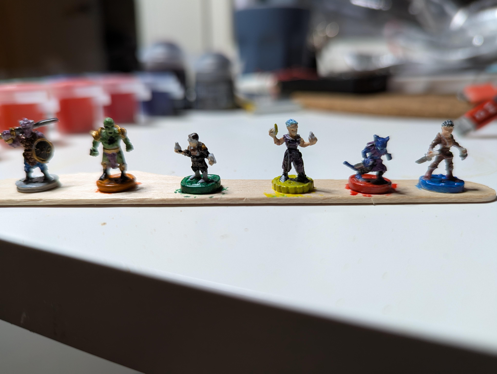

I managed to setup hugo and git under Termux on my phone. Using zettelnotes I can now make pages for my mini blog. Yay! 

As a first try I will attach a photo from my phone. It shows my attempt to paint the character tokens from "Buttons And Bugs"

